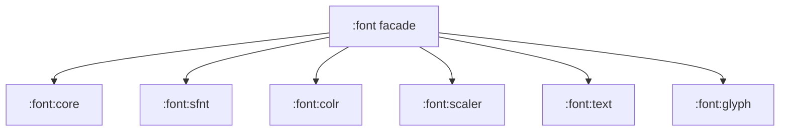

# Kalligraphie

[](https://kotlinlang.org)
[](https://gradle.org)
[](LICENSE)
[](CONTRIBUTING.md)

Kalligraphie is a JVM library for reading, shaping, scaling, and rendering font data.

## Modules



- `:font:core` — shared font primitives.
- `:font:sfnt` — SFNT/OpenType table parsing.
- `:font:colr` — COLR color-font support.
- `:font:scaler` — glyph scaling and rasterization.
- `:font:text` — text shaping.
- `:font:glyph` — public glyph facade.
- `:font` — aggregate facade for consumers.

## Development

```bash
# Run the JVM test suite for all font modules.
./gradlew :font:fontTest

# Generate and embed the API reference into the MkDocs site.
./gradlew :docs:embedDokkaIntoMkDocs

# Build the documentation site.
mkdocs build -f docs/mkdocs.yml
```

## Contributing

Read [CONTRIBUTING.md](CONTRIBUTING.md) before opening a pull request. The documentation site is published from the `master` branch by [docs.yml](.github/workflows/docs.yml).
